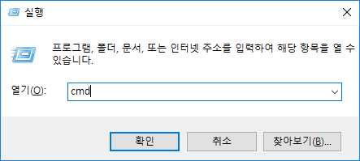
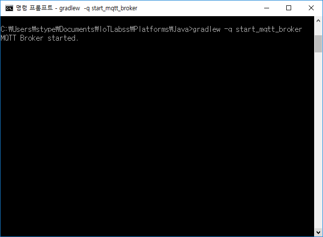
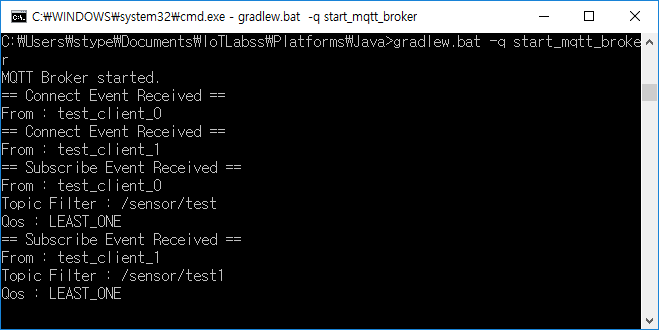

#How to run MQTT Server (Powered by mosquitto)

* Download the platform from repository and unzip it.

  <center></center>

* Turn on the CMD and change the directory to the MQTT Server's home directory

  <center></center>

  ```

  C:\Users\Administration > cd [$APP_HOME]

  ```

* Type following statement to run MQTT Server

  ```

  [$APP_HOME] > graldew -q start_mqtt_broker

  ```

* After starting task is done, a message 'MQTT Broker started' comes up.

  <center></center>
  
# MQTT Receiver Registration

* Make JSON file to register MQTT Receivers.

  * Example file
  
    > ../Platforms/Java/src/main/resources/config/mqtt_receiver.json
     
     
  * How to write MQTT receiver information
    
    * Data Type : JSON
    
    * Structure
    
      ```
    
      {
        "receivers" : [
          {
             "broker_url" : [Put your receiver's Address]
             "client_id" : [Put your receiver's ID]
             "topic" : [Put a topic your receiver subscribes]
             "qos" : [Put your receiver's qos level **]
             "is_persist" : [Enable message auto-registered to Database]
           }
           .
           .
           .
        ]
      }  
    
      ```
      
      
        > QOS Level
          
          
          * QOS 0 : Publish a message once without success or failure. 
          
          * QOS 1 : Publish a single message more than once until message-delivering success.
          
          * QOS 2 : Publish a message in once with 4-level-handshaking.

* Turn on the CMD and change the directory to the MQTT Server's home directory

  <center></center>

  ```

  C:\Users\Administration > cd [$APP_HOME]

  ```

* Type following statement to register receivers.

  ```

  [$APP_HOME] > graldew -q register_receivers -Pf=[$src_of_preference_file]

  ```

* After registration task is done, some messages like below comes up.

  <center></center>
  
* Also in server command, registeration success messages alert too.

  <center></center>
