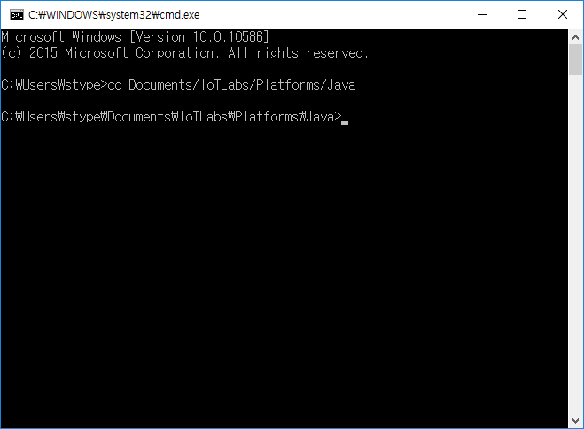

#How to run MQTT Server (Powered by mosquitto)


##Windows

* Download the platform from repository and unzip it.


* Turn on the CMD and change the directory to the MQTT Server's home directory




```

C:\Users\Administration > cd [$APP_HOME]

```

* Type following statement to run MQTT Server


```

[$APP_HOME] > graldew -q start_mqtt_broker

```

* After starting task is done, a message 'MQTT Broker started' comes up.
