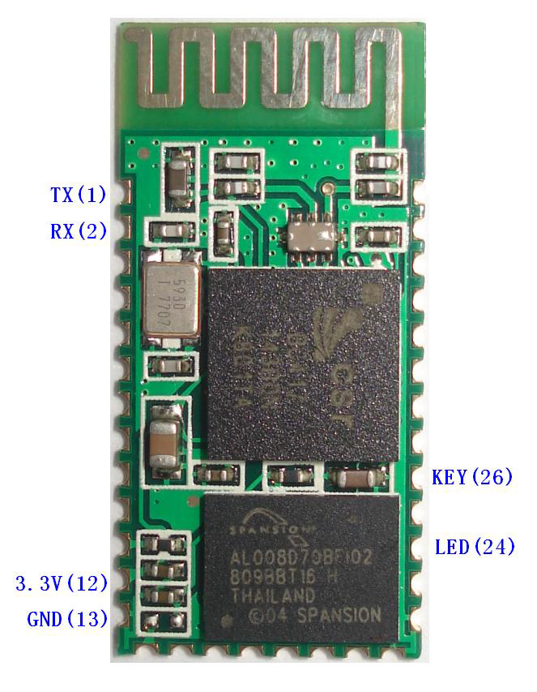

# Bluetooth 통신 모듈 HC-06

*This document is written using Hangul(Korean) as much as possible.*

__아두이노에서 사용되는 대표적인 블루투스 모듈인 HC-06에 대해 정리합니다.__

또한 본 프로젝트에서는 HC-06을 활용한 다른 기기와의 통신을 구현합니다.

- 목차
  1. HC-06 특징 소개
  2. HC-06의 핀 설명
  3. AT 명령어
  

## 1. HC-06 특징 소개

  
  - 무선 전송 모듈
    1. 수신감도 -80dBm 까지 도달
    2. 전송 전력 -4 ~ +6dBm
    
  - 기능
    1. 2.4GHz 안테나 내장으로 안테나 테스트가 필요 없다.
    2. 8Mbit 외장 플래시 메모리를 가지고 있다.
    3. 3.1V~4.2V의 저전압에서 동작 가능하며, 30~40mA 범위에서 페어링이 가능하다. (통신 전류 8mA)   
    4. UART/USB를 사용한다.
    5. CSR BC04 블루투스 기술을 기본으로 한다.
    6. 보관 온도: -40°C ~ 85°C, 동작 온도: -25°C ~ 75°C
    7. 저전력 시스템

## 2. HC-06의 핀 설명

## 3. AT 명령어

__전송은 HC-06으로 보내는 문자열이며,
  반환은 HC-06으로 부터 받는 문자열이다.__

* 통신 테스트
  + 전송: AT
  + 반환: OK
  
* 블루투스 Baud rate 변경
  + 전송: AT+BAUD1 or ATBAUD2 ...
  + 반환: OK1200 or OK 2400 ...
  + 1~9, A, B, C 까지 지원하며, C에서 최대 1382400 까지 지원한다.
  
* 블루투스 이름 변경
  + 전송: AT+NAME*your_bluetooth_name*
  + 반환: OK*your_bluetooth_name*
  
* 블루투스 비밀번호 변경
  + 전송: AT+PIN*your_bluetooth_password*
  + 반환: OKsetpin
  
* 블루투스 AT 버전 확인
  + 전송: AT+VERSION
  + 반환: *your_at_version*  

     