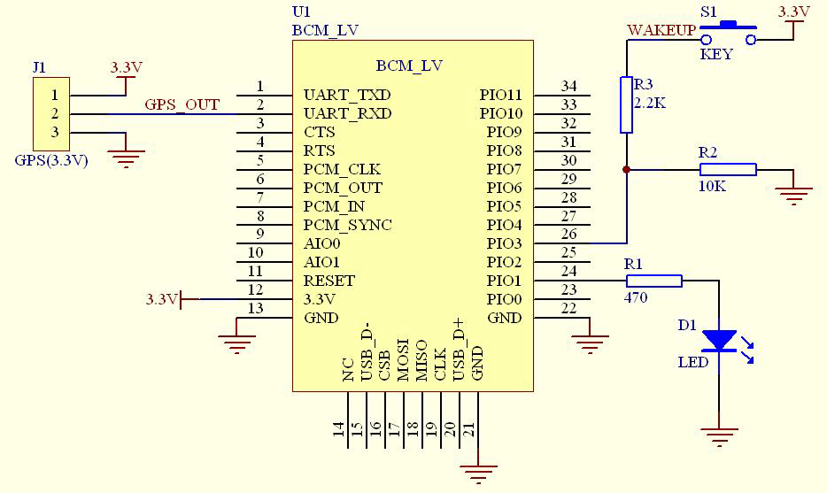

# Bluetooth 통신 모듈 HC-06


*This document is written using Hangul(Korean) as much as possible.*

__아두이노에서 사용되는 대표적인 블루투스 모듈인 HC-06에 대해 정리합니다.__

또한 본 프로젝트에서는 HC-06을 활용한 다른 기기와의 통신을 구현합니다.

- 목차
  1. HC-06 특징 소개
  2. HC-06의 핀 설명
  3. AT 명령어
  


## 1. HC-06 특징 소개

  
  - 블루투스 무선 전송 모듈
    1. 수신감도 -80dBm 까지 도달
    2. 전송 전력 -4 ~ +6dBm
    
  - 기능
    1. 2.4GHz 안테나 내장으로 안테나 테스트가 필요 없다.
    2. 8Mbit 외장 플래시 메모리를 가지고 있다.
    3. 3.1V~4.2V의 저전압에서 동작 가능하며, 30~40mA 범위에서 페어링이 가능하다. (통신 전류 8mA)   
    4. UART/USB를 사용한다.
    5. CSR BC04 블루투스 기술을 기본으로 한다.
    6. 보관 온도: -40°C ~ 85°C, 동작 온도: -25°C ~ 75°C
    7. 저전력 시스템

## 2. HC-06의 핀 설명
>
> ####[HC-06 Diagram]

핀 이름    | 핀 번호     | 핀 타입                         | 설명                                                          | 비고
--------- | ---------- | ------------------------------ | ------------------------------------------------------------- | ---
GND       | 13, 21, 22 | VSS                            | 그라운드(접지)                                                  | Source에 연결되는 전원
1V8       | 14         | VDD                            | +1.7V~+1.9V 범위의 온칩 선형 레귤레이터를 갖춘 +1.8V 전원 공급 장치 |
VCC       | 12         | 3.3V                           |                                                               |
AIO0      | 9          | 양방향(입/출력)                  | Programmable 입/출력                                           |
AIO1      | 10         | 양방향(입/출력)                  | Programmable 입/출력                                           |
PIO0      | 23         | 양방향(입/출력)/Rx 가능          | Programmable 입/출력, LNA(저잡음 증폭)을 위한 출력 제어            |
PIO1      | 24         | 양방향(입/출력)/Tx 가능          | Programmable 입/출력, PA(전력 증폭)을 위한 출력 제어              |
PIO2      | 25         | 양방향(입/출력)                  | Programmable 입/출력                                           |
PIO3      | 26         | 양방향(입/출력)                  | Programmable 입/출력                                           |
PIO4      | 27         | 양방향(입/출력)                  | Programmable 입/출력                                           |
PIO5      | 28         | 양방향(입/출력)                  | Programmable 입/출력                                           |
PIO6      | 29         | 양방향(입/출력)                  | Programmable 입/출력                                           | Clock 요청(CLK_REQ)
PIO7      | 30         | 양방향(입/출력)                  | Programmable 입/출력 | Clock 출력(CLK_OUT)                     |
PIO8      | 31         | 양방향(입/출력)                  | Programmable 입/출력                                           |
PIO9      | 32         | 양방향(입/출력)                  | Programmable 입/출력                                           |
PIO10     | 33         | 양방향(입/출력)                  | Programmable 입/출력                                           |
PIO11     | 34         | 양방향(입/출력)                  | Programmable 입/출력                                           |
RESETB    | 11         | 내부 풀다운을 가진 CMOS 입력      |                                                               | 
UART_RTS  | 4          | CMOS 출력, 내부 풀업의 3가지 상태 | UART 요청(Request) 전송, Active Low                            |
UART_CTS  | 3          | 내부 풀다운을 가진 CMOS 입력      | UART 초기화(Clear) 전송, Active Low                            |
UART_RX   | 2          | 내부 풀다운을 가진 CMOS 입력      | UART 데이터 입력                                               |
UART_TX   | 1          | CMOS 출력, 내부 풀업의 3가지 상태 | UART 데이터 출력                                               |
SPI_MOSI  | 17         | 내부 풀다운을 가진 CMOS 입력      | SPI 입력 | Master Out Slave Input                             |
SPI_CSB   | 16         | 내부 풀업을 가진 CMOS 입력        | SPI 칩 선택                                                   |
SPI_CLK   | 19         | 내부 풀다운을 가진 CMOS 입력      | SPI 동기 신호(Clock)                                           |
SPI_MISO  | 18         | 내부 풀다운을 가진 CMOS 입력      | SPI 출력 | Master Input Slave Output                          |
USB_-     | 15         | 양방향                          |                                                               |
USB_+     | 20         | 양방향                          |                                                               |
PCM_CLK   | 5          | 양방향                          |                                                               | Pulse-Code Modulation 동기 신호(Clock)
PCM_OUT   | 6          | CMOS 출력                       |                                                               | PCM 출력
PCM_IN    | 7          | CMOS 입력                       |                                                               | PCM 입력
PCM_SYNC  | 8          | 양방향                          |                                                               | PCM 동기화
 

## 3. AT 명령어

__전송은 HC-06으로 보내는 문자열이며,
  반환은 HC-06으로 부터 받는 문자열이다.__

* 통신 테스트
  + 전송: AT
  + 반환: OK
  
* 블루투스 Baud rate 변경
  + 전송: AT+BAUD*1* or AT+BAUD*2* ...
  + 반환: OK1200 or OK2400 ...
  + 1~9, A, B, C 까지 지원하며, C에서 최대 1382400 까지 지원한다.
  
  | BAUD*param* | BAUD rate | 비고 |
  | ----------- | --------- | --- |
  | 1 | 1200 
  | 2 | 2400 
  | 3 | 4800 
  | 4 | 9600 | 기본 값
  | 5 | 19200 
  | 6 | 38400
  | 7 | 57600
  | 8 | 115200
  | 9 | 230400
  | A | 460800
  | B | 921600
  | C | 1382400

* 블루투스 이름 변경
  + 전송: AT+NAME*your_bluetooth_name*
  + 반환: OK*your_bluetooth_name*
  
* 블루투스 비밀번호 변경
  + 전송: AT+PIN*your_bluetooth_password*
  + 반환: OKsetpin
  
* 블루투스 AT 버전 확인
  + 전송: AT+VERSION
  + 반환: *your_at_version*  

* 1:1 통신을 위한 Master/Slave 설정
  + 전송: AT+ROLE=M(*Master 모드*) or AT+ROLE=S(*Slave 모드*)
  + 반환: OK+ROLE:M or OK+ROLE:S

* PIO(Digital I/O) 핀 설정
  + *param1* : PIO 포트 번호(10진수)
  + *param2* : PIO 포트 상태(0 : Low level, 1 : High level)
  + 전송: AT+PIO=*param1*, *param2*
  + 반환: OK
  + 예시: PI010 포트 High level 출력 
  ```
  AT+PI0=10, 1\r\n
  OK
  ```

## 참고문헌
[1] : https://www.olimex.com/Products/Components/RF/BLUETOOTH-SERIAL-HC-06/resources/hc06.pdf

[2] : https://m.blog.naver.com/PostView.nhn?blogId=2hyoin&logNo=220490286425&proxyReferer=https%3A%2F%2Fwww.google.co.kr%2F