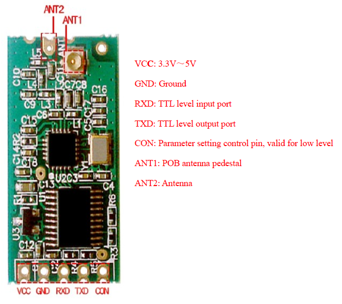
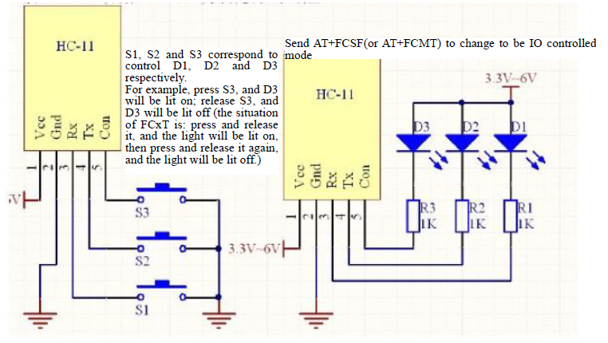

# RF 통신 모듈 HC-11


*This document is written using Hangul(Korean) as much as possible.*

__아두이노에서 사용되는 RF 모듈인 HC-11에 대해 정리합니다.__


- 목차
  1. HC-11 특징 소개
  2. HC-11의 핀 설명
  3. AT 명령어
  
  
 ## 1. HC-11 특징 소개
 
 
   - RF(Radio Frequency) 무선 통신 모듈
     1. 반이중 전송방식
     2. 80μA 유휴 전력(Idle current)
     3. 많은 수의 바이트를 한 번에 전송할 수 있음
     
   - 기능
     1. 433Mhz 주파수 대역 사용
     2. 저전력(유휴 전력 80μA, 3.5mA, 22mA 등의 모드를 선택할 수 있음)
     3. 한 번에 많은 수의 바이트를 모듈의 시리얼 포트로 전송할 수 있음.
     4. 동작 전압 : 3.3V ~ 6V
     5. 통신 거리 : (실내) 1M ~ 40M, (실외) 이론적으로 200M까지 통신
     6. 4가지의 통신 모드 지원
   
   - 통신 모드
     1. FU1 : 기본 모드, 유휴 전력은 3.4mA
     2. FU2 : 평균 유휴 전력은 80μA이지만, 딜레이가 길다. Baud rate는 1200, 2400, 4800만 사용 가능하다. 245 바이트를 한 번에 전송할 수 있다.
     3. FU3 : 유휴 전력은 23mA로 FU1, FU2 모드보다 크다. 고속을 필요로 하는 Question-and-Answer 시스템에서 사용할 수 있다.
     4. FU4 : 펌웨어 V1.8부터 지원, Baud rate에 따른 전송 거리/딜레이가 길어지지만 다른 모드들과 비교해서 더 멀리 전송할 수 있다.
     
     | Mode                    | FU1   | FU2   | FU3  | FU4  | 비고 |
     |-------------------------|-------|-------|------|------|-----|
     | 유휴 전력                | 3.5mA | 80μA  | 22mA | 22mA | 평균 값 |
     | 전송 딜레이              | 20mS  | 380mS | 2mS  | 7mS  | 1 바이트 전송 | 
     | Loopback 테스트 딜레이 1 | 31mS   | 8mS  | 22mS |      | Baud rate 9600으로 1 바이트 전송 |
     | Loopback 테스트 딜레이 2 | 31mS   | 18mS | 40mS |      | Baud rate 9600으로 10 바이트 전송 |
     *Loopback 테스트 : 한 쪽의 모듈에서 Tx/Rx 핀을 통해 다른 모듈로 데이터를 보낸 뒤, 다른 모듈의 Tx 핀에 도달하기 까지의 딜레이*
    
   - 모듈 주소 : 000 ~ 255, 기본 주소는 000.
   
   - 통신 채널 : 001 ~ 127, 기본 채널은 001이며 채널이 너무 높게 설정되면 데이터 손실이 일어날 수 있다. 권장 채널은 001 ~ 020.
    
   - __HC-11 기본 설정 : FU1, 모듈 주소 000, 통신 채널 001, 전송 전력 P8(10dBm)__
     
## 2. HC-11의 핀 설명
  
  - 상기 HC-11 그림 참조
    1. VCC : 3.3V, 5V 등 
    2. GND : 접지
    3. RXD(TTL) : UART 데이터 입력(MCU의 TX에 연결)
    4. TXD(TTL) : UART 데이터 출력(MCU의 RX에 연결)
    5. CON(또는 SET) : AT 모드 접근할 때 GND로 연결하고, 통신 모드일 경우 


## 3. AT 명령어

> 앞서 핀 설명에서 언급한 바와 같이 AT 명령어를 사용하기 위해서 CON(SET) 핀을 GND에 연결한 뒤 사용한다.

__전송은 HC-11으로 보내는 바이트들이며,
  반환은 HC-11으로 부터 받는 바이트들이다.__
  
 
  
* 통신 테스트
  + 전송: AT
  + 반환: OK
  
* 모듈의 주소 변경
  + 전송: AT+A*000* or AT+A*128* ...
  + 반환: OK-A000 or OK-A128 ...
  + A*x* 파라미터는 000부터 최대 255까지 지원한다.
  
* 모듈 Baud rate 변경
  + 전송: AT+B*9600* or AT+BAUD*19200* ...
  + 반환: OK-B9600 or OK-B19200 ...
  + 1200, 2400, 4800, 9600(기본값), 19200, 38400, 57600, 115200(권장하지 않음)을 지원한다.
  
* 모듈의 채널 변경
  + 전송: AT+C*001* or AT+C*127* ...
  + 반환: OK-C001 or OK-C127 ...
  + C*x* 파라미터는 001부터 최대 127까지 지원하며, 권장 채널 범위는 001 ~ 020이다.
  
* 원격지 모듈의 AT 설정 변경
  + 전송: AT+E*B**4800* or AT+E*C**020* ...
  + 반환: EBR or ECR ...
  + E*x**y* x 파라미터는 A, B, C 각각 Address, Baud rate, Channel을 의미하며, y 파라미터는 A, B, C에 대한 설정 값.
  + 반환 결과는 3가지이다. E*y*E(오류), E*y*R(정상 수행), E*y*F(명령어 오류)

* 모듈의 프로세서를 이용한 무선 IO 포트 제어
  + *param1*: M or S, Master 또는 Slave 모듈 설정
  + *param2*: F or T, 원격지 IO 포트를 동일한 상태로 변경(Follow)과 반전(Turnover)
  + 전송 : AT+FCMT or AT+FCST ...
  + __AT 설정을 한 뒤 반드시 AT 모드를 종료한다.__
  ```
  전송 모듈에 AT+FCMF
  수신 모듈에 AT+FCSF
  를 전송한다. (아래 그림 참고)
  ```
 

* 모듈의 무선 전송 모드 변경(펌웨어 V1.8 이상) 
  + 전송: AT+FU*1*(기본 값) or AT+FU*4* ...
  + 반환: OK-FU1 or OK-FU4 ...

* 전송 전력 변경 
  + 전송: AT+P*8* or AT+P*1* ...
  + 반환: OK-P8 or OK-P1 ...
  + P*x* 파라미터는 1부터 8까지 각각 -30dBm, -20dBm, -15dBm, -10dBm,0dBm, 5dBm, 7dBm, 10dBm(기본값)
                          
* 설정된 모든 매개변수 출력 
  + 전송: AT+RX
  + 반환: B9600 C001 A000 P8
  
* 패리티 비트 설정 
  + 전송: AT+U*N**1* or AT+U*E**2* ...
  + 반환: OK-UN1 or OK-UE2 ...
  + *param1*: N(no parity), O(홀수), E(짝수) 패리티 비트
  + *param2*: 1(stop bit), 2(2), 3(1)

* 버전 정보 요청 
  + 전송: AT+V
  + 반환: HC-11_V1.7 ...
  
  ## 참고문헌
  [1] : https://www.elecrow.com/download/HC-11.pdf